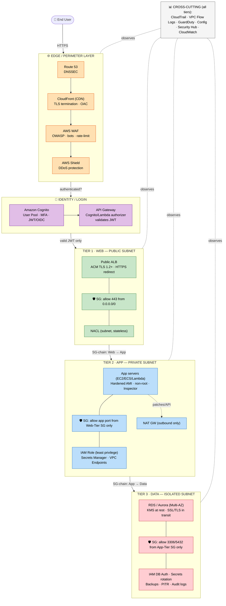

# AWS 3-Tier Architecture — Security Recommendations & Best Practices

> Interview prep guide: How to secure a classic 3-tier web application on AWS, documented tier-by-tier with concrete AWS services, controls, and talking points.

---

## 1. What is a 3-Tier Architecture?

A 3-tier architecture separates an application into three logical and physical layers, each with its own responsibility and security boundary:

| Tier | Name | Typical AWS Components | Purpose |
|------|------|------------------------|---------|
| **Tier 1** | Presentation / Web Tier | CloudFront, ALB, EC2/ECS/Fargate, S3 (static assets) | Serves UI, handles client requests |
| **Tier 2** | Application / Logic Tier | EC2/ECS/EKS/Lambda in private subnets | Business logic, processing |
| **Tier 3** | Data Tier | RDS, Aurora, DynamoDB, ElastiCache | Persistent storage |

**Core principle:** *Defense in depth* — apply layered, independent security controls so a breach in one tier does not compromise the others.

```
                          Internet
                             │
                    ┌────────▼─────────┐
                    │   Route 53 / WAF  │
                    │    CloudFront     │
                    └────────┬─────────┘
   ── PUBLIC SUBNET ─────────▼──────────────────────
                    ┌──────────────────┐
   TIER 1 (WEB)     │  Public ALB      │
                    └────────┬─────────┘
   ── PRIVATE SUBNET (APP) ──▼──────────────────────
                    ┌──────────────────┐
   TIER 2 (APP)     │ App servers /     │
                    │ Internal ALB      │
                    └────────┬─────────┘
   ── PRIVATE SUBNET (DATA) ─▼──────────────────────
                    ┌──────────────────┐
   TIER 3 (DATA)    │ RDS / Aurora      │
                    │ (Multi-AZ)        │
                    └──────────────────┘
```

---

## 2. Foundational (Cross-Cutting) Security Controls

These apply to **all** tiers and are usually the first thing an interviewer wants to hear:

- **VPC isolation** — Deploy everything inside a VPC. Use **public subnets** only for the web/load-balancer layer; place app and data tiers in **private subnets**.
- **Least privilege IAM** — Use **IAM roles** (not long-lived access keys) for EC2/ECS/Lambda. Scope policies tightly; avoid `*` actions/resources.
- **Encryption everywhere**:
  - *In transit*: TLS 1.2+ everywhere (ACM-managed certificates on CloudFront/ALB).
  - *At rest*: KMS-managed encryption for EBS, S3, RDS, DynamoDB, snapshots, backups.
- **Secrets management** — Store DB credentials, API keys in **AWS Secrets Manager** or **SSM Parameter Store (SecureString)**; enable automatic rotation.
- **Logging & monitoring** — Enable **CloudTrail** (API auditing), **VPC Flow Logs**, **CloudWatch**, **GuardDuty** (threat detection), **AWS Config** (compliance/drift), **Security Hub** (aggregation).
- **Network Security Groups vs NACLs**:
  - **Security Groups (SG)** — stateful, instance/ENI level → primary control.
  - **Network ACLs (NACL)** — stateless, subnet level → coarse secondary control.
- **DDoS protection** — **AWS Shield Standard** (free, always on); **Shield Advanced** for critical workloads.
- **Multi-AZ / redundancy** — Not strictly security, but availability is part of the CIA triad.

---

## 3. Defense-in-Depth — Layered Security Model

**Definition:** *Defense in depth* means no single control is trusted to stop an attack. You stack **independent, overlapping layers** so that if one fails, the next still protects the system. An attacker must defeat **every** layer to reach the data.

### 3.1 The 7 Security Layers (mapped to AWS)

```
┌─────────────────────────────────────────────────────────────┐
│ LAYER 1 · EDGE / PERIMETER   Route 53 (DNSSEC), CloudFront,   │
│                              AWS WAF, AWS Shield              │  ← blocks bots, DDoS, OWASP
├─────────────────────────────────────────────────────────────┤
│ LAYER 2 · NETWORK            VPC, Public/Private/Isolated     │
│                              subnets, IGW, NAT GW, route tbls │  ← isolation & segmentation
├─────────────────────────────────────────────────────────────┤
│ LAYER 3 · SUBNET BOUNDARY    NACLs (stateless, coarse)        │  ← subnet-level allow/deny
├─────────────────────────────────────────────────────────────┤
│ LAYER 4 · INSTANCE / ENI     Security Groups (stateful,       │
│                              SG-referenced chaining)          │  ← per-tier micro-perimeter
├─────────────────────────────────────────────────────────────┤
│ LAYER 5 · IDENTITY & ACCESS  IAM roles, least privilege,      │
│                              IAM DB auth, Secrets Manager     │  ← who can do what
├─────────────────────────────────────────────────────────────┤
│ LAYER 6 · COMPUTE / HOST     Hardened AMIs (CIS), Patch Mgr,  │
│                              Inspector, non-root containers   │  ← host hardening
├─────────────────────────────────────────────────────────────┤
│ LAYER 7 · DATA               KMS at rest, TLS in transit,     │
│                              backups, Macie, DB privileges    │  ← protect the crown jewels
└─────────────────────────────────────────────────────────────┘
    Cross-cutting (all layers): CloudTrail · VPC Flow Logs ·
    GuardDuty · AWS Config · Security Hub  → detect & respond
```

### 3.2 How the Layers Reinforce Each Other

| # | Layer | AWS Controls | If an attacker gets past the previous layer... |
|---|-------|--------------|-------------------------------------------------|
| 1 | Edge / Perimeter | Route 53, CloudFront, WAF, Shield | ...they still hit the network isolation |
| 2 | Network | VPC, subnets, IGW/NAT, route tables | ...private subnets have no inbound internet path |
| 3 | Subnet | NACLs | ...stateless deny rules block disallowed ports/CIDRs |
| 4 | Instance | Security Groups (SG-chaining) | ...each tier only accepts traffic from the tier above |
| 5 | Identity | IAM roles, Secrets Manager | ...least-privilege limits what a compromised host can do |
| 6 | Host | Hardened AMIs, patching, Inspector | ...reduced vulnerabilities & no exploitable services |
| 7 | Data | KMS, TLS, IAM DB auth | ...encrypted data is useless without keys |

### 3.3 Key Principles

- **Redundant controls** — NACLs (subnet) *and* Security Groups (instance) both filter traffic; a misconfig in one is caught by the other.
- **Segmentation** — each tier has its own subnet + SG; lateral movement is blocked by default.
- **Least privilege everywhere** — network (SG chaining), identity (scoped IAM), and data (DB privileges) each enforce minimum access independently.
- **Assume breach** — even if the web tier is compromised, the DB stays protected (no route + SG denies + encrypted + credentials in Secrets Manager).
- **Detect & respond** — CloudTrail, GuardDuty, and Flow Logs span every layer.

> **Interview one-liner:** *"Defense in depth means an attacker must defeat WAF, network routing, a NACL, a security group, IAM, host hardening, and finally KMS encryption — seven independent layers — to reach the data."*

---

## 4. Tier 1 — Presentation / Web Tier Security

**Goal:** Protect the public entry point; filter malicious traffic before it reaches compute.

**Security Group rules:**

| Direction | Source/Dest | Port | Purpose |
|-----------|-------------|------|---------|
| Inbound | `0.0.0.0/0` | 443 | HTTPS from internet (to ALB) |
| Inbound | `0.0.0.0/0` | 80 | HTTP → redirect to 443 |
| Outbound | App Tier SG | 8080/app port | Forward to app tier only |

### Tier 1 — Security Checklist (by category)

| Category | Controls You Can Implement |
|----------|----------------------------|
| **Network isolation** | Public subnet for ALB only; instances in private subnets; IGW attached only to public route table; no public IPs on backend instances |
| **Edge / perimeter** | CloudFront (hide origin, cache), **AWS WAF** (OWASP, bots, rate-limit, geo-blocking), **AWS Shield** (DDoS), Route 53 DNSSEC |
| **Encryption in transit** | ACM-managed **TLS 1.2+**, HTTPS redirect, **HSTS**, disable weak ciphers via ELB security policy |
| **Access control** | Security Group allows only 80/443 inbound; forward only to App-Tier SG; NACL subnet guard |
| **Content protection** | S3 static assets private via **Origin Access Control (OAC)**; block public bucket access |
| **Admin access** | **SSM Session Manager** (no open SSH/RDP); bastion locked to corporate IPs if required |
| **Monitoring** | CloudFront/WAF logs, ALB access logs, VPC Flow Logs, GuardDuty, CloudWatch alarms |

---

## 5. Tier 2 — Application / Logic Tier Security

**Goal:** Isolate business logic; only accept traffic from the web tier; never expose to the internet.

**Security Group rules:**

| Direction | Source/Dest | Port | Purpose |
|-----------|-------------|------|---------|
| Inbound | **Web Tier SG** (reference, not CIDR) | app port | Only allow traffic from Tier 1 |
| Outbound | **Data Tier SG** | 3306/5432 | Only talk to DB tier |
| Outbound | NAT GW / VPC endpoints | 443 | Patching, AWS API calls |

> **Key interview point:** Reference the **source SG ID**, not IP CIDR ranges — this creates a dynamic trust chain (Web SG → App SG → Data SG).

### Tier 2 — Security Checklist (by category)

| Category | Controls You Can Implement |
|----------|----------------------------|
| **Network isolation** | Private subnets, no public IPs; inbound impossible from internet; outbound only via **NAT Gateway** |
| **Access control** | Security Group accepts app port **only from Web-Tier SG** (SG-chaining); outbound only to Data-Tier SG + VPC endpoints |
| **Identity (machine)** | **IAM instance/task roles**, least privilege; no long-lived access keys; scoped to specific resources |
| **Secrets** | **Secrets Manager** / SSM Parameter Store (SecureString) with rotation; retrieved at runtime, never hardcoded |
| **Encryption** | EBS/EFS encrypted with **KMS**; **TLS** for all internal service-to-service calls |
| **Host hardening** | CIS-hardened AMIs, **Patch Manager**, non-root containers, **Inspector** vulnerability scans, ECR image scanning |
| **Private connectivity** | **VPC Endpoints / PrivateLink** for S3, DynamoDB, Secrets Manager — keeps AWS API traffic off the internet |
| **Request validation** | Trust only requests carrying a **valid JWT** verified upstream at API Gateway/Cognito |
| **Resilience** | Auto Scaling groups across AZs; health checks |
| **Monitoring** | VPC Flow Logs, CloudWatch app/agent logs, GuardDuty, CloudTrail for API calls |

---

## 6. Tier 3 — Data Tier Security

**Goal:** Maximum isolation — the data tier is the crown jewel and should be reachable **only** by the app tier.

**Security Group rules:**

| Direction | Source/Dest | Port | Purpose |
|-----------|-------------|------|---------|
| Inbound | **App Tier SG** only | 3306 (MySQL) / 5432 (Postgres) | Only app tier can connect |
| Outbound | (typically none / restricted) | — | DBs rarely initiate outbound |

### Tier 3 — Security Checklist (by category)

| Category | Controls You Can Implement |
|----------|----------------------------|
| **Network isolation** | Dedicated **isolated subnet** (no IGW/NAT route); **DB subnet group** across private subnets only; no public IP / disable public accessibility |
| **Access control** | Security Group allows DB port **only from App-Tier SG** (SG-chaining); NACL subnet guard; no direct human access |
| **Encryption at rest** | **KMS** (enable at creation) for RDS/Aurora/DynamoDB, snapshots, backups, read replicas; prefer **customer-managed keys (CMK)** |
| **Encryption in transit** | Enforce **SSL/TLS** (`rds.force_ssl=1`); DynamoDB over HTTPS; require certificate validation |
| **Authentication** | **IAM database authentication** (token-based); or **Secrets Manager** with **automatic rotation**; no shared passwords |
| **Authorization** | Least privilege **DB users** (separate read/write/admin); DynamoDB fine-grained IAM policies |
| **Auditing & monitoring** | DB audit logs → CloudWatch; **RDS Enhanced Monitoring** + Performance Insights; **GuardDuty RDS Protection**; **AWS Config** rules (detect unencrypted/public DBs) |
| **Backup & recovery** | Automated backups, encrypted snapshots, **Point-in-Time Recovery**, cross-region replication for DR |
| **Resilience** | **Multi-AZ** failover; **deletion & termination protection** |
| **Sensitive data** | **Amazon Macie** (PII discovery in S3); column/field-level encryption or tokenization; data masking for non-prod |

---

## 7. User Authentication & Login (What AWS Recommends)

**Goal:** Authenticate and authorize *end users* — separate from the IAM roles used by compute. AWS recommends **not building your own auth**; use managed identity services.

### 7.1 Amazon Cognito (primary recommendation for app users)

| Component | Role | What it does |
|-----------|------|--------------|
| **User Pools** | Authentication (who you are) | Sign-up/sign-in, password policies, **MFA**, adaptive auth; issues **JWT** (OAuth2/OIDC) tokens |
| **Identity Pools** | Authorization (AWS access) | Exchange tokens for **temporary, scoped AWS credentials** via STS |
| **Federation** | External IdPs | Social (Google, Apple) + enterprise **SAML/OIDC** (Okta, Azure AD) |

> **Interview point:** *User Pool = authentication; Identity Pool = authorization (temporary STS credentials).*

### 7.2 Workforce / Admin Login

- **IAM Identity Center (AWS SSO)** for employee console/CLI access; federate with corporate IdP.
- Use **federated IAM roles** (SAML/OIDC) — no long-lived IAM users for humans.
- **Never use the root account** for daily work; enable **MFA on root**.

### 7.3 Login Best Practices

- **Enforce MFA** (mandatory for admins) and **strong password policies**.
- **Token-based auth** (OAuth2/OIDC/JWT) with **short-lived tokens**; validate JWTs at **API Gateway** (Cognito/Lambda authorizer) before requests reach the app tier.
- **Never store passwords yourself** — offload to Cognito/IdP.
- **Protect the login endpoint** with **WAF** (rate-limiting, credential-stuffing / account-takeover rules).
- **Audit logins** via Cognito + CloudTrail; alert on anomalies (GuardDuty).

### 7.4 Where Login Fits in the Flow

```
User → CloudFront/WAF → ALB (Tier 1) → API Gateway (validates JWT via Cognito)
                                              │ authenticated request only
                                        App Tier (Tier 2) → Data Tier (Tier 3)
```

Authentication happens at the **edge/web tier**, so unauthenticated requests never reach the app or data tiers — reinforcing **defense in depth**.

---

## 8. Summary — Security Controls by Tier

| Control Area | Tier 1 (Web) | Tier 2 (App) | Tier 3 (Data) |
|--------------|--------------|--------------|---------------|
| **Subnet** | Public (ALB) / Private (instances) | Private | Private / Isolated |
| **Internet Access** | Inbound via ALB | Outbound via NAT only | None |
| **Primary SG source** | `0.0.0.0/0:443` | Web Tier SG | App Tier SG |
| **Edge protection** | WAF, Shield, CloudFront | — | — |
| **Encryption in transit** | ACM/TLS at ALB & CF | TLS internal | SSL to DB |
| **Encryption at rest** | S3/EBS (KMS) | EBS (KMS) | RDS/DynamoDB (KMS) |
| **Identity** | — | IAM roles | IAM DB auth / Secrets Mgr |
| **Key AWS services** | CloudFront, WAF, ALB, ACM | EC2/ECS/Lambda, NAT, VPC Endpoints | RDS/Aurora/DynamoDB, KMS |

---

## 9. Common Interview Questions & Talking Points

1. **Why put the ALB in a public subnet but instances in private?**
   → Minimizes attack surface; only the load balancer is exposed, instances are unreachable directly from the internet.

2. **How do the tiers talk to each other securely?**
   → Security Groups reference each other by SG ID, forming a chain: Web SG → App SG → Data SG. Traffic is allowed only from the tier directly above.

3. **How does the app tier reach the internet without being exposed?**
   → Outbound-only through a **NAT Gateway**; inbound connections from the internet are impossible.

4. **How do you avoid hardcoding DB credentials?**
   → **Secrets Manager** with automatic rotation, retrieved at runtime via IAM role.

5. **Difference between Security Groups and NACLs?**
   → SGs are **stateful** and operate at the ENI/instance level; NACLs are **stateless** and operate at the subnet level. SGs are the primary control; NACLs add a coarse secondary layer.

6. **How do you keep AWS API traffic off the public internet?**
   → **VPC Endpoints / PrivateLink** for S3, DynamoDB, Secrets Manager, etc.

7. **How do you handle admin access without opening SSH?**
   → **SSM Session Manager** — no bastion, no open inbound ports, fully audited.

8. **What monitoring would you enable?**
   → CloudTrail, VPC Flow Logs, GuardDuty, Config, Security Hub, and CloudWatch alarms.

9. **What does defense in depth mean in this architecture?**
   → Multiple independent, overlapping layers (edge → network → subnet → instance → identity → host → data) so that if one control fails or is misconfigured, the next still protects the system. An attacker must defeat *every* layer to reach the data.

10. **Give an example of redundant controls.**
   → Both **NACLs** (subnet, stateless) and **Security Groups** (instance, stateful) filter traffic. If an SG is accidentally left too open, the NACL still blocks disallowed subnet traffic — and vice versa.

11. **How do you handle end-user login/authentication?**
   → Use **Amazon Cognito** (managed) — never build your own auth. **User Pools** authenticate users and issue OAuth2/OIDC JWTs with MFA; **Identity Pools** exchange those tokens for temporary, least-privilege AWS credentials via STS. Validate JWTs at **API Gateway** so unauthenticated traffic never reaches the app tier.

12. **How is user login different from IAM roles?**
   → **IAM roles** authenticate *AWS services/compute* (EC2, Lambda) to call AWS APIs. **Cognito** authenticates *application end users*. For workforce/admin console access, use **IAM Identity Center (SSO)** with federation — not IAM users.

---

## 10. Well-Architected Alignment

Maps to the **AWS Well-Architected Framework — Security Pillar**:
- **Identity & Access Management** → IAM roles, least privilege
- **Detective Controls** → CloudTrail, GuardDuty, Config, Security Hub
- **Infrastructure Protection** → VPC, subnets, SGs, NACLs, WAF, Shield
- **Data Protection** → KMS encryption, Secrets Manager, TLS
- **Incident Response** → Automated alerts, isolation playbooks, backups

> **Closing statement for interview:** *"Security in a 3-tier AWS architecture is about defense in depth — isolate each tier in its own subnet, allow only the minimum required traffic between tiers using chained security groups, encrypt data in transit and at rest, manage identity through IAM roles and secrets rotation, and maintain continuous visibility through logging and threat detection."*

---

## 11. End-to-End Security Flow Diagram (Top → Bottom)

This diagram shows how security controls are applied at **every tier**, top to bottom, as a request travels from the user to the database.



### Top-to-Bottom Security Checkpoints

| Step | Layer | Security Control Applied |
|------|-------|--------------------------|
| 1 | **User → Edge** | HTTPS/TLS; Route 53 DNSSEC |
| 2 | **Edge** | CloudFront hides origin; **WAF** blocks OWASP/bots; **Shield** absorbs DDoS |
| 3 | **Login** | **Cognito** authenticates (MFA + JWT); **API Gateway** rejects invalid/unauthenticated tokens |
| 4 | **Tier 1 (Web)** | Public subnet; **ALB** with ACM TLS; **SG** allows only 443; NACL subnet guard |
| 5 | **Tier 1 → Tier 2** | **SG chaining** — App SG accepts traffic *only* from Web SG |
| 6 | **Tier 2 (App)** | Private subnet (no inbound internet); **IAM role** least privilege; secrets from Secrets Manager; NAT for egress only |
| 7 | **Tier 2 → Tier 3** | **SG chaining** — DB SG accepts traffic *only* from App SG |
| 8 | **Tier 3 (Data)** | Isolated subnet (no internet route); **KMS** at rest; **TLS** in transit; IAM DB auth; encrypted backups |
| 9 | **All tiers** | Continuous logging & threat detection (CloudTrail, Flow Logs, GuardDuty, Config, Security Hub) |

> **Text fallback (if Mermaid does not render):**
> `User → [Route53/CloudFront/WAF/Shield] → [Cognito + API Gateway auth] → [Tier 1: ALB + SG(443) in public subnet] → SG-chain → [Tier 2: App + IAM role in private subnet, NAT egress] → SG-chain → [Tier 3: RDS + KMS in isolated subnet]`, with **CloudTrail / Flow Logs / GuardDuty / Config / Security Hub** observing every layer.
