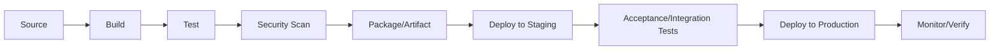
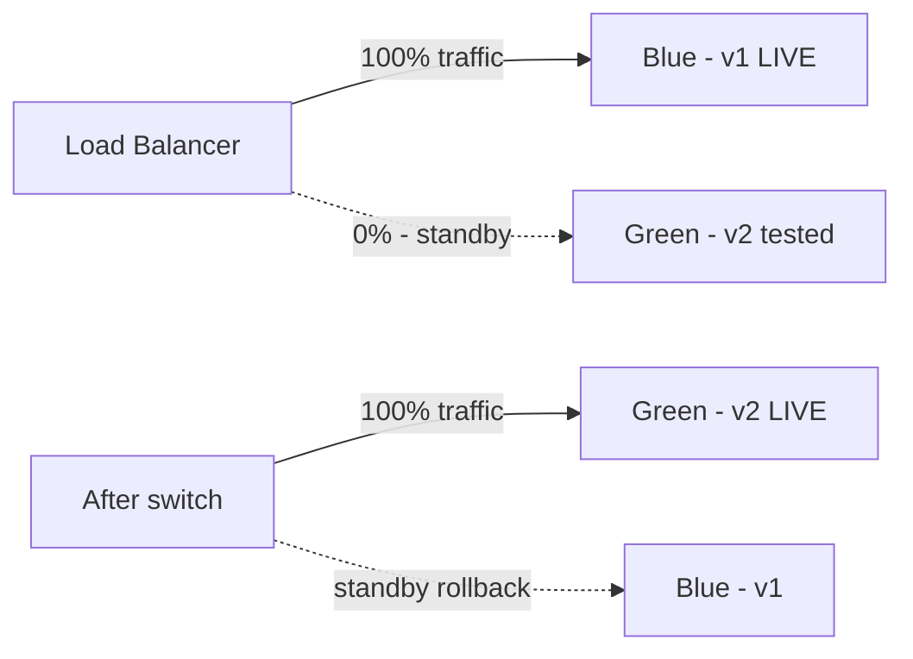
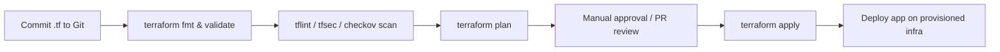
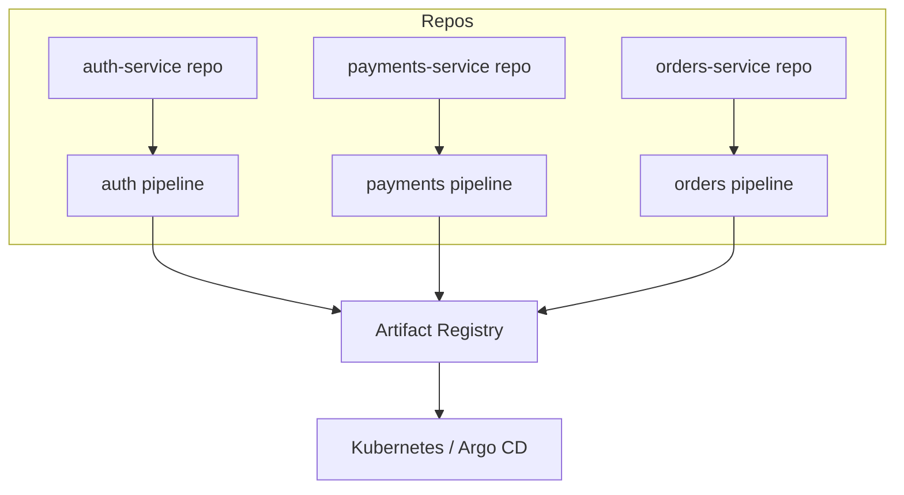
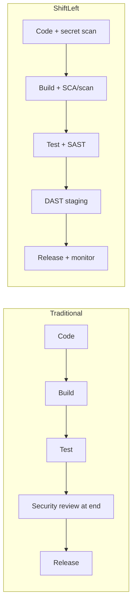
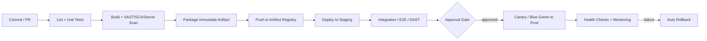
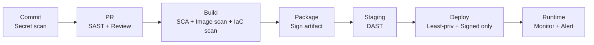

# CI/CD Interview Preparation Guide

A comprehensive, scenario-driven guide covering CI/CD concepts, pipeline design, deployment strategies, and real-world practices. Each answer includes a **definition/explanation**, **use case/example**, and **interview tips**.

---

## Table of Contents

1. [Core Concepts](#core-concepts) (Q1–Q4)
2. [Pipeline Practices & Deployments](#pipeline-practices--deployments) (Q5–Q13)
3. [Testing & Security](#testing--security) (Q14–Q15)
4. [Bonus Questions](#bonus-questions)
5. [Quick Reference Cheat Sheet](#quick-reference-cheat-sheet)

---

# Core Concepts

---

## 🔹 Question 1: Explain the definitive differences between Continuous Integration (CI), Continuous Delivery (CD), and Continuous Deployment (CD).

**Answer:**

| Practice | What it automates | End state |
|----------|-------------------|-----------|
| **Continuous Integration (CI)** | Developers merge code frequently to a shared branch; every commit triggers automated **build + tests**. | Verified, integrated code (a tested build artifact). |
| **Continuous Delivery (CD)** | Extends CI so every validated change is automatically prepared and released to a repository/staging — **ready to deploy** to production at any time. | Deployment is **one manual approval/click** away. |
| **Continuous Deployment (CD)** | Extends Continuous Delivery — every change that passes all automated tests is **automatically deployed to production** with no human gate. | Code reaches production **fully automatically**. |

**The key distinction:**
- **Continuous Delivery** = automated up to production, **manual approval** to release.
- **Continuous Deployment** = automated **all the way to production**, no manual step.

**Analogy:**
- CI = you keep merging and testing your work so it always fits together.
- Continuous Delivery = the package is boxed, labeled, and sitting at the door — someone decides when to ship.
- Continuous Deployment = the package ships automatically the moment it's ready.

**Use case:**
- A bank uses **Continuous Delivery** — automated pipeline builds a production-ready artifact, but a release manager approves the final production push (compliance).
- A SaaS product like a web app uses **Continuous Deployment** — dozens of production deploys a day, each fully automated behind feature flags.

**Interview tip:** The classic trap is confusing the two "CD"s. Emphasize the **human approval gate** is the only difference between Delivery and Deployment.

---

## 🔹 Question 2: Outline the common stages of a robust CI/CD pipeline and the primary goal of each stage.

**Answer:**



| Stage | Primary Goal |
|-------|--------------|
| **1. Source** | Trigger the pipeline on a commit/PR; fetch code from version control. |
| **2. Build/Compile** | Turn source into a runnable/deployable form; fail fast on compile errors. |
| **3. Test** | Run unit tests (fast) then integration tests; validate correctness. |
| **4. Static Analysis / Security Scan** | Lint, SAST, dependency/CVE scanning, secret detection (shift-left quality & security). |
| **5. Package / Artifact** | Produce an immutable, versioned artifact (e.g., Docker image, JAR) and push to an artifact repository. |
| **6. Deploy to Staging** | Release to a production-like environment for realistic validation. |
| **7. Acceptance / E2E Tests** | Verify end-to-end behavior, smoke tests, performance checks. |
| **8. Deploy to Production** | Release the *same artifact* using a safe strategy (blue/green, canary). |
| **9. Monitor / Verify** | Post-deploy health checks, metrics, and alerting; enable fast rollback. |

**Key principle: Build once, deploy everywhere.** The **same artifact** built once should flow through every environment — never rebuild per environment.

**Use case:**
A commit to `main` triggers build → tests → SAST → Docker image pushed to registry → deploy to staging → E2E tests → canary to production → monitor. If any stage fails, the pipeline stops and notifies the team.

**Interview tip:** Emphasize **fail fast** (cheap/fast checks first) and **build-once/promote-the-same-artifact** across environments.

---

## 🔹 Question 3: How do you securely manage sensitive data like API keys, database credentials, and access tokens within your CI/CD pipeline?

**Answer:**
**Never hardcode secrets** in code, Dockerfiles, or pipeline YAML. Use a layered approach:

1. **Dedicated secret managers**: HashiCorp Vault, AWS Secrets Manager, Azure Key Vault, GCP Secret Manager. Pipeline retrieves secrets at runtime.
2. **CI/CD native secret stores**: GitHub Actions Secrets, GitLab CI/CD variables (masked + protected), Jenkins Credentials plugin. Injected as environment variables/masked.
3. **Short-lived / dynamic credentials**: Prefer **OIDC federation** (e.g., GitHub Actions → AWS via `AssumeRoleWithWebIdentity`) so no long-lived cloud keys are stored at all.
4. **Least privilege**: each pipeline/job gets only the scopes it needs.
5. **Masking & audit**: mask secrets in logs; audit access; rotate regularly.
6. **Secret scanning**: run tools (Gitleaks, TruffleHog) to catch accidental commits.

**Example (GitHub Actions with OIDC — no stored AWS keys):**
```yaml
permissions:
  id-token: write
  contents: read
jobs:
  deploy:
    runs-on: ubuntu-latest
    steps:
      - uses: aws-actions/configure-aws-credentials@v4
        with:
          role-to-assume: arn:aws:iam::123456789012:role/ci-deploy
          aws-region: us-east-1
      - run: aws s3 sync ./dist s3://my-bucket
```

**Example (Vault retrieval at runtime):**
```bash
export DB_PASSWORD=$(vault kv get -field=password secret/prod/db)
```

**Interview tip:** The strongest answer mentions **OIDC/short-lived credentials** over static secrets, plus **rotation**, **masking in logs**, and **least privilege**. Mention secret scanning to catch leaks.

---

## 🔹 Question 4: What is a build artifact, and what is the importance of an Artifact Repository like Artifactory or Nexus?

**Answer:**
A **build artifact** is the immutable, versioned output of the build stage — the deployable package (e.g., Docker image, `.jar`/`.war`, npm package, compiled binary, Helm chart).

An **Artifact Repository** (JFrog Artifactory, Sonatype Nexus, container registries like ECR/GHCR) is a central store for these artifacts.

**Why it matters:**
- **Immutability & traceability**: a versioned artifact (`app:1.4.2`) is built once and promoted unchanged through environments — guaranteeing what you tested is what you deploy.
- **Single source of truth** for binaries, decoupled from source control.
- **Dependency caching/proxying**: caches external deps (Maven Central, npm) for faster, more reliable builds and protection against upstream outages.
- **Access control, retention, and cleanup** policies.
- **Security**: integrates vulnerability scanning (e.g., Xray) and signing.

**Use case:**
CI builds `payment-service:2.1.0` once, pushes to Artifactory. Staging pulls `2.1.0`, tests pass, and production pulls the **exact same `2.1.0`** — no rebuild, no drift. If a bug is found, you can trace the artifact back to its exact commit.

**Interview tip:** Tie it to **"build once, deploy everywhere"** and **immutability**. Mention dependency proxying/caching and integrated security scanning as bonus value.

---

# Pipeline Practices & Deployments

---

## 🔹 Question 5: You're deploying a new version that requires a database schema change. How do you handle the database migration safely within your pipeline?

**Answer:**
Use the **Expand/Contract (a.k.a. parallel change) pattern** with **backward-compatible, versioned migrations** so the DB and app can be deployed independently without downtime.

**Principles:**
- Migrations are **backward-compatible** — the *old* app version must still work against the *new* schema during rollout.
- Use a **migration tool** (Flyway, Liquibase, Alembic, Rails/Django migrations) with versioned, idempotent scripts stored in version control.
- **Decouple schema changes from code deploys** and run them as an explicit, ordered pipeline step.

**Expand → Migrate → Contract example (renaming a column):**
1. **Expand**: add the new column `full_name` (nullable). Old code ignores it. ✅ backward-compatible.
2. **Deploy code** that writes to *both* `name` and `full_name` (dual-write) and reads new.
3. **Backfill** data from `name` → `full_name`.
4. **Deploy code** that uses only `full_name`.
5. **Contract**: drop the old `name` column once nothing references it.

**Pipeline snippet:**
```yaml
- stage: migrate
  script: flyway -url=$DB_URL -user=$DB_USER migrate   # runs versioned scripts
- stage: deploy-app
  script: kubectl set image deploy/api api=repo/api:2.0
```

**Additional safety:** always **back up** before destructive changes, test migrations on a staging copy, wrap in transactions where the DB supports DDL transactions, and have a rollback/undo script.

**Interview tip:** The senior answer is **expand/contract + backward compatibility** so blue/green and rollbacks stay safe. Stress that you never drop/rename in the same release that stops using the old schema.

---

## 🔹 Question 6: Describe the Blue/Green Deployment strategy and explain how it achieves zero downtime.

**Answer:**
Blue/Green runs **two identical production environments**:
- **Blue** = current live version serving all traffic.
- **Green** = new version, deployed and fully tested in parallel while Blue still serves users.

Once Green passes health checks/smoke tests, the **router/load balancer switches all traffic** from Blue to Green **instantly**. Blue is kept on standby for fast rollback.



**How it achieves zero downtime:**
- The new version is fully up and validated **before** any user traffic hits it.
- The traffic switch is atomic (DNS/LB/router change) — users experience no gap.
- **Rollback = switch back to Blue** in seconds.

**Use case:**
Deploy v2 to Green, run smoke tests against it, then flip the ALB target group to Green. If errors spike, flip back to Blue immediately — instant rollback with no rebuild.

**Trade-offs:** requires **double the infrastructure** during the switch; database schema must be compatible with both versions (see Q5).

**Interview tip:** Emphasize the **instant, low-risk rollback** and the **DB compatibility** requirement. Contrast with canary (Q13).

---

## 🔹 Question 7: Your deployment to production just failed a crucial post-deployment health check. What is your immediate and preferred rollback strategy?

**Answer:**
**Immediate action: roll back to the last known-good version automatically and fast.** The preferred approach depends on the deployment strategy:

1. **Blue/Green** → **switch the router back to Blue** (the previous version). Fastest, near-instant, lowest risk.
2. **Canary / rolling** → **halt the rollout and route 100% back to the stable version**; scale the new version to zero.
3. **Immutable artifacts** → **redeploy the previous versioned artifact** (`app:1.9.0`) — never patch in place.

**Automate it:** the pipeline should trigger rollback automatically on health-check failure:
```yaml
- name: Health check
  run: ./scripts/health-check.sh || echo "unhealthy" >> $GITHUB_ENV
- name: Auto rollback
  if: failure()
  run: kubectl rollout undo deployment/api
```

**Key practices:**
- **Roll back first, investigate later** — restore service, then diagnose from logs/metrics.
- **Database**: because migrations were backward-compatible (Q5), rolling back the app is safe. Avoid destructive schema changes tied to the same release.
- **Post-incident**: capture logs, run a blameless postmortem, add a regression test.

**Interview tip:** Lead with **"restore service immediately via the last known-good version,"** mention automation, and note that **backward-compatible migrations** are what make app rollback safe.

---

## 🔹 Question 8: Which Git branching strategy—Trunk-Based Development or GitFlow—do you prefer for CI/CD, and why?

**Answer:**
For **true CI/CD, I prefer Trunk-Based Development (TBD).**

**Trunk-Based Development:**
- Everyone commits to a single main branch (`main`/`trunk`) frequently (at least daily), using **short-lived** feature branches (hours to a day or two).
- Incomplete work is hidden behind **feature flags**.
- **Why it fits CI/CD:** small, frequent merges = fewer/smaller merge conflicts, continuous integration in the truest sense, and the trunk is always releasable — perfect for continuous deployment.

**GitFlow:**
- Multiple long-lived branches (`develop`, `release`, `feature/*`, `hotfix/*`, `main`).
- Great for **scheduled/versioned releases** and projects supporting multiple versions (e.g., installed software), but long-lived branches cause **big, painful merges** ("merge hell") and delay integration — friction against continuous deployment.

| Aspect | Trunk-Based | GitFlow |
|--------|-------------|---------|
| Branch life | Short (hours/days) | Long-lived |
| Integration | Continuous | Delayed |
| Best for | CI/CD, web/SaaS, high deploy frequency | Scheduled releases, versioned products |
| Feature isolation | Feature flags | Feature branches |
| Merge pain | Low | Higher |

**Use case:**
A SaaS team deploying many times a day uses TBD + feature flags. A desktop app vendor shipping quarterly versions with multiple supported releases may use GitFlow.

**Interview tip:** Say **TBD for CI/CD** and justify with *small batches + always-releasable trunk + feature flags*. Acknowledge GitFlow's fit for versioned/scheduled release products — shows nuance.

---

## 🔹 Question 9: Your CI build time increased from 5 to 15 minutes. How do you find the bottleneck and what optimizations would you suggest?

**Answer:**

**Step 1 — Measure/diagnose:**
- Examine the pipeline's **per-stage timing** breakdown (most CI systems provide this).
- Compare recent runs to find *which stage* regressed (tests? dependency install? build? image push?).
- Check recent changes: new tests, added dependencies, larger image, disabled caching.

**Step 2 — Optimize (common levers):**

| Optimization | How |
|--------------|-----|
| **Dependency caching** | Cache `~/.m2`, `node_modules`, pip cache, Docker layers between runs. |
| **Parallelization** | Split test suites and run stages in parallel across runners/matrix jobs. |
| **Docker layer caching / BuildKit** | Order Dockerfile least→most changing; use `--mount=type=cache`, registry cache. |
| **Test optimization** | Run only affected tests (test impact analysis); move slow E2E to a later/nightly stage. |
| **Incremental builds** | Build only changed modules in a monorepo (Bazel, Nx, Turborepo). |
| **Bigger/faster runners** | More CPU/RAM or self-hosted runners for heavy jobs. |
| **Fail fast** | Run fast unit tests + lint first; gate expensive steps. |
| **Artifact reuse** | Don't rebuild artifacts already built earlier in the pipeline. |

**Example (cache in GitHub Actions):**
```yaml
- uses: actions/cache@v4
  with:
    path: ~/.npm
    key: npm-${{ hashFiles('package-lock.json') }}
```

**Use case:**
Investigation shows tests jumped from 2→11 min after a new E2E suite ran serially. Fix: parallelize the suite across 4 shards and cache dependencies → back to ~5 min.

**Interview tip:** Always **measure before optimizing**. Top wins are usually **caching + parallelization + running only affected tests**.

---

## 🔹 Question 10: How does Infrastructure as Code (IaC) with Terraform or CloudFormation integrate into your CI/CD pipeline?

**Answer:**
IaC treats infrastructure definitions as **version-controlled code**, deployed through the same automated, reviewed pipeline as application code — giving repeatable, auditable, consistent environments.

**Typical IaC pipeline flow (Terraform):**


| Step | Purpose |
|------|---------|
| `fmt` / `validate` | Syntax and formatting checks. |
| **Security scan** (`tfsec`, `checkov`) | Catch insecure config (open security groups, public buckets). |
| `plan` | Show the exact changes; post as a PR comment for review. |
| **Approval gate** | Human reviews the plan before touching infra (esp. prod). |
| `apply` | Provision/update infrastructure. |
| **Remote state + locking** | S3 + DynamoDB (or Terraform Cloud) to prevent concurrent conflicting applies. |

**Best practices:**
- Store **state remotely** with locking; never commit state or secrets.
- Separate state/workspaces per environment (dev/staging/prod).
- Gate `apply` on `plan` review; use least-privilege pipeline credentials (OIDC).
- Immutable/versioned modules.

**Use case:**
A PR changing `main.tf` triggers `plan`, which comments the diff on the PR. After approval and merge, the pipeline runs `apply` to provision an EKS cluster, then deploys the app onto it — all automated and audited.

**Interview tip:** Highlight **plan-then-approve-then-apply**, **remote state + locking**, and **security scanning** of IaC. Mention drift detection as a bonus.

---

## 🔹 Question 11: How can you deploy an unfinished feature to production via Continuous Deployment without exposing it to all users?

**Answer:**
Use **Feature Flags (feature toggles)** — the feature's code is deployed to production but kept **disabled**, decoupling **deploy** from **release**.

**How it works:**
- Wrap new functionality in a runtime conditional controlled by a flag.
- The code ships to production continuously (merged to trunk), but the flag is **off** for users.
- Turn the flag **on** selectively — internal testers, a % of users, specific segments — without a redeploy.

**Example:**
```python
if feature_flags.is_enabled("new_checkout", user=current_user):
    return new_checkout_flow()
else:
    return legacy_checkout_flow()
```

**Benefits:**
- Enables **Trunk-Based Development** (merge incomplete work safely).
- **Progressive rollout** and instant kill-switch (turn off on problems — faster than a rollback).
- Supports **A/B testing** and targeted release.

**Tools:** LaunchDarkly, Unleash, Flagsmith, Split, or a homegrown config-based system.

**Use case:**
A new checkout page is merged and deployed all week behind an off flag. QA enables it for internal accounts, then 5% of users, then 100% — all via flag changes, no deployments. If conversion drops, flip the flag off instantly.

**Interview tip:** Emphasize **decoupling deploy from release** and the **kill switch**. Mention flag hygiene — remove stale flags to avoid tech debt.

---

## 🔹 Question 12: You have a Microservices Architecture. How would you structure your CI/CD pipelines?

**Answer:**
**Independent pipelines per service**, so each microservice can be built, tested, and deployed **autonomously** — the core benefit of microservices.

**Structure & principles:**
1. **One pipeline per service** (typically one repo per service — polyrepo — each with its own pipeline). Each deploys independently.
2. **Monorepo option**: a single repo with **path-based triggers** so only the changed service's pipeline runs (e.g., changes under `services/payments/**` trigger only the payments pipeline). Use tooling like Nx/Bazel/Turborepo for affected-only builds.
3. **Standardized/templated pipelines**: shared reusable pipeline templates (GitHub reusable workflows, GitLab includes, Jenkins shared libraries) for consistency and less duplication.
4. **Independent versioning & artifacts**: each service produces its own versioned image.
5. **Contract testing** (Pact) to catch breaking API changes between services without full E2E coupling.
6. **Independent deployment strategies** (canary per service) and per-service rollback.
7. **Orchestration/GitOps**: use Argo CD/Flux to sync deployments to Kubernetes declaratively.



**Use case:**
The payments team pushes a change; only the payments pipeline runs, builds `payments:3.2.1`, contract tests pass, and it canary-deploys to prod — without rebuilding or redeploying auth or orders.

**Interview tip:** Lead with **independent, decoupled pipelines**. Mention **path-based triggers** (monorepo), **shared templates** for consistency, **contract testing**, and **GitOps**.

---

## 🔹 Question 13: Contrast Blue/Green deployment with Canary Deployment and explain when you would choose Canary.

**Answer:**

| Aspect | Blue/Green | Canary |
|--------|-----------|--------|
| Traffic shift | **All at once** (0%→100%) after switch | **Gradual** (e.g., 5% → 25% → 50% → 100%) |
| Risk exposure | Full user base immediately after switch | Small subset first — limited blast radius |
| Rollback | Switch back to Blue (instant) | Route the small % back to stable |
| Infra cost | Double environment during switch | Runs both versions but scales gradually |
| Real-user validation | After full switch | Continuous during rollout with real traffic |
| Speed | Fast cutover | Slower, monitored rollout |

**Blue/Green**: two full environments; flip all traffic at once after validating Green.
**Canary**: release the new version to a **small percentage of real users**, monitor key metrics (errors, latency, business KPIs), and **progressively increase** traffic only if healthy — otherwise roll back the small slice.

**When to choose Canary:**
- You want to **limit blast radius** and validate against **real production traffic/behavior** that's hard to reproduce in staging.
- **High-traffic, high-risk** services where a bad release affecting everyone is unacceptable.
- You want **data-driven rollout** (automated analysis of metrics gating each step — e.g., Argo Rollouts, Flagger).
- Cost-sensitive scenarios where doubling the whole environment (blue/green) is expensive.

**Choose Blue/Green when** you need **instant, clean cutover and rollback**, releases are lower-frequency, and you can afford duplicate infra — and when partial rollout doesn't make sense (e.g., stateful cutovers).

**Use case:**
A high-traffic API rolls out v2 to 5% of users; automated canary analysis watches error rate and p99 latency. Metrics stay green → ramp to 100%. A spike at 25% → auto-rollback affecting only that slice.

**Interview tip:** Canary = **gradual, metric-gated, minimal blast radius**; Blue/Green = **instant full cutover with easy rollback**. Mention automated canary analysis tools (Flagger, Argo Rollouts).

---

# Testing & Security

---

## 🔹 Question 14: What is a "flaky test", and what is its negative impact on the CI/CD pipeline? How do you deal with them?

**Answer:**
A **flaky test** is a test that produces **inconsistent results** (sometimes passes, sometimes fails) **without any code change** — non-deterministic behavior.

**Common causes:**
- Timing/race conditions, improper `sleep`/async handling.
- Test-order dependencies or shared mutable state between tests.
- External dependencies (network, real APIs, DB) not mocked.
- Environment differences, time zones, random data.

**Negative impact:**
- **Erodes trust** in the pipeline — developers start ignoring failures ("just re-run it").
- **Blocks deployments** and wastes time on false failures.
- Masks *real* bugs behind the noise.
- Slows the pipeline (reruns, investigations).

**How to deal with them:**
1. **Detect & track**: identify flaky tests (rerun analysis, flaky-test dashboards in CI, e.g., quarantine reports).
2. **Quarantine**: move known-flaky tests to a separate suite so they don't block the pipeline while being fixed — but track them (don't just ignore).
3. **Fix the root cause**: replace `sleep` with proper waits/polling, mock external services, isolate state, make tests order-independent and deterministic.
4. **Retry sparingly**: automatic retry can be a stopgap but **hides** flakiness — never a permanent fix.
5. **Prevent**: enforce test isolation, deterministic data, hermetic tests, and code review standards.

**Use case:**
An E2E test intermittently fails because it clicks a button before the page finishes loading. Fix: wait for the element/network idle instead of a fixed `sleep(2)`. Meanwhile it's quarantined so it doesn't block deploys.

**Interview tip:** Stress that flakiness **destroys confidence** in CI. The right response is **quarantine + fix the root cause**, not blanket retries.

---

## 🔹 Question 15: Explain the concept of "Shift-Left" in the context of CI/CD security.

**Answer:**
**"Shift-Left"** means moving activities — especially **security and testing** — **earlier** ("to the left") in the software development lifecycle, rather than treating them as a final gate before release. In security this is called **DevSecOps**: security is everyone's responsibility, integrated throughout the pipeline.

**Why:** the earlier a defect/vulnerability is found, the **cheaper and faster** it is to fix. Finding a security flaw in the IDE or PR costs far less than finding it in production.

**Shift-Left security practices across the pipeline:**

| When | Practice | Tools (examples) |
|------|----------|------------------|
| **IDE / pre-commit** | Linting, secret detection, IDE security plugins | pre-commit hooks, Gitleaks |
| **Commit / PR** | **SAST** (static app security testing), code review | SonarQube, Semgrep, CodeQL |
| **Build** | **SCA** (dependency/CVE scanning), SBOM generation | Snyk, Dependabot, OWASP Dependency-Check, Trivy |
| **Build (containers)** | Image vulnerability scanning, IaC scanning | Trivy, Grype, tfsec, Checkov |
| **Pre-deploy** | **DAST** (dynamic testing) in staging | OWASP ZAP |
| **Runtime** | Continuous monitoring, image signing | Falco, Cosign |

**Traditional (right) vs Shift-Left:**


**Use case:**
A dependency with a critical CVE is caught by SCA during the **build stage** and fails the pipeline immediately — instead of being discovered by a pentest weeks after production release.

**Interview tip:** Define shift-left as **"security/testing early and continuously, automated in the pipeline."** Name concrete gates — **SAST, SCA, secret scanning, IaC/container scanning, DAST** — and stress the cost-of-fix argument.

---

# Bonus Questions

---

## 🔹 Bonus 1: What is GitOps, and how does it relate to CI/CD?

**Answer:**
**GitOps** uses **Git as the single source of truth for declarative infrastructure and application state**. An agent (Argo CD, Flux) continuously **reconciles** the actual cluster state to match what's declared in Git.

**Key ideas:**
- Desired state (manifests, Helm, Kustomize) lives in Git.
- **Pull-based**: the in-cluster operator pulls and applies changes (vs. CI pushing).
- Any drift is auto-corrected; every change is a Git commit (auditable, revertable via `git revert`).

**Relation to CI/CD:** CI builds/tests and updates the image tag in the Git config repo; **CD is handled by the GitOps operator** syncing that change to the cluster.

**Interview tip:** Contrast **push-based** (pipeline runs `kubectl apply`) vs **pull-based GitOps** (operator reconciles). Highlight auditability and easy rollback via Git.

---

## 🔹 Bonus 2: What are quality gates in a CI/CD pipeline?

**Answer:**
**Quality gates** are automated pass/fail checkpoints that a build must satisfy to proceed. Examples: minimum **test coverage** threshold, **zero critical vulnerabilities**, no failing tests, code-quality score (SonarQube), no lint errors, performance budgets.

If a gate fails, the pipeline stops — enforcing standards automatically and consistently.

**Interview tip:** Tie gates to **fail-fast** and **shift-left**; they prevent low-quality/insecure code from progressing.

---

## 🔹 Bonus 3: How do you handle deployments across multiple environments (dev/staging/prod)?

**Answer:**
- **Promote the same immutable artifact** through environments; never rebuild per environment.
- **Externalize configuration** per environment (env vars, config maps, secret managers) — config differs, artifact doesn't.
- **Progressive approval gates** — auto-deploy to dev, gated/automated tests to staging, manual/automated approval to prod.
- Use **environment parity** so staging mirrors production closely.

**Interview tip:** The core principle: **one artifact, many environments, config injected at deploy time.**

---

## 🔹 Bonus 4: How do you design a CI/CD pipeline for production use?

**Answer:**
Design for **speed, safety, repeatability, and observability**. A production-grade pipeline is automated end-to-end, gated at the right points, and built on immutable artifacts.

**Design principles:**
1. **Trigger on version control** — every commit/PR triggers the pipeline (webhook/branch rules).
2. **Fail fast** — run the cheapest, fastest checks first (lint → unit tests → build) before expensive ones.
3. **Build once, promote everywhere** — one immutable, versioned artifact flows through all environments; config injected per environment.
4. **Quality & security gates** — enforce coverage, SAST/SCA, and vulnerability thresholds; block on failure.
5. **Progressive environments with approvals** — auto to dev/staging, gated (manual or automated canary analysis) to prod.
6. **Safe deployment strategy** — blue/green or canary with automated health checks and **automatic rollback**.
7. **Observability & feedback** — post-deploy monitoring, alerting, and fast notifications to the team.

**Reference production pipeline:**


**Stage-by-stage goals:**
| Stage | Goal | Gate |
|-------|------|------|
| Source | Trigger + fetch | Branch protection |
| Test | Fast unit tests | All pass |
| Security scan | SAST/SCA/secrets | No critical vulns |
| Build/Package | Immutable versioned artifact | Build success |
| Registry | Store artifact | Signed image |
| Staging | Production-like validation | E2E/DAST pass |
| Approval | Human/automated gate | Approved |
| Production | Canary/blue-green rollout | Health checks pass |
| Monitor | Verify + alert | Auto-rollback on failure |

**Non-functional requirements to build in:**
- **Idempotency & reproducibility** (same input → same output).
- **Secrets** via a secret manager / OIDC (never hardcoded).
- **IaC** for environment provisioning (Terraform) through the same pipeline.
- **Rollback plan** for both app and database (backward-compatible migrations).
- **Audit trail** — every deploy traceable to a commit and artifact version.
- **Notifications** — Slack/Teams/email on success/failure.

**Use case:**
For a production web service: commit to `main` → lint + unit tests → SAST/SCA + build Docker image → push signed image to ECR → deploy to staging → run E2E + DAST → manual approval → **canary to prod (5%→100%)** with Prometheus-based automated analysis → auto-rollback if error rate/latency breaches thresholds → Slack notification.

**Interview tip:** Structure the answer around **stages + gates + safety (rollback) + observability**. Emphasize **build-once/immutable artifacts**, **shift-left security**, and **automated rollback** — these signal production maturity.

---

## 🔹 Bonus 5: What tools have you used in a CI/CD pipeline?

**Answer:**
Frame this by **category** so you show breadth across the whole delivery lifecycle. (Tailor to your actual experience in a real interview.)

| Category | Tools |
|----------|-------|
| **Version Control** | Git (GitHub, GitLab, Bitbucket, Azure Repos) |
| **CI/CD Orchestration** | Jenkins, GitHub Actions, GitLab CI, CircleCI, Azure DevOps, Travis CI, Argo Workflows |
| **Build Tools** | Maven, Gradle, npm/yarn, Make, Docker/BuildKit |
| **Artifact Repository** | JFrog Artifactory, Sonatype Nexus, AWS ECR, GitHub Container Registry (GHCR), Docker Hub |
| **Testing** | JUnit, PyTest, Jest, Selenium, Cypress, Playwright, Postman/Newman, Pact (contract testing) |
| **Code Quality / SAST** | SonarQube, Semgrep, CodeQL, ESLint/linters |
| **Security Scanning (SCA/containers/IaC)** | Snyk, Trivy, Grype, OWASP Dependency-Check, tfsec, Checkov, Gitleaks/TruffleHog, OWASP ZAP (DAST) |
| **Infrastructure as Code** | Terraform, AWS CloudFormation, Pulumi, Ansible |
| **Containers & Orchestration** | Docker, Kubernetes, Helm, Kustomize |
| **GitOps / CD** | Argo CD, Flux |
| **Progressive Delivery** | Argo Rollouts, Flagger, Spinnaker |
| **Feature Flags** | LaunchDarkly, Unleash, Flagsmith |
| **Secrets Management** | HashiCorp Vault, AWS Secrets Manager, Azure Key Vault, GCP Secret Manager |
| **Monitoring & Observability** | Prometheus, Grafana, ELK/EFK stack, Datadog, CloudWatch, Jaeger (tracing) |
| **Notifications / ChatOps** | Slack, Microsoft Teams, PagerDuty, email |

**How to answer in an interview:**
> "In my most recent project I used **GitHub Actions** for orchestration, building **Docker** images pushed to **ECR**, with **SonarQube** and **Trivy** for quality and security scanning, **Terraform** for infrastructure, and **Argo CD** for GitOps-based deployment to **Kubernetes**. Monitoring was handled with **Prometheus/Grafana**, and secrets came from **AWS Secrets Manager** via OIDC."

**Interview tip:** Don't just list tools — describe **how they fit together** in a real pipeline and **why** you chose them. Depth on a coherent stack beats a long unexplained list.

---

## 🔹 Bonus 6: How do you ensure security in your pipeline?

**Answer:**
Apply **DevSecOps / shift-left** — security is built into every stage, not bolted on at the end. Secure the **pipeline itself**, the **code/dependencies**, the **artifacts**, and the **runtime**.

**1. Secure the code (early / shift-left):**
- **Secret scanning** (Gitleaks, TruffleHog) on commits/PRs to catch leaked credentials.
- **SAST** (SonarQube, Semgrep, CodeQL) to find code vulnerabilities.
- Mandatory **peer code review** + branch protection.

**2. Secure the dependencies:**
- **SCA** (Snyk, Dependabot, OWASP Dependency-Check) to detect vulnerable libraries and CVEs.
- Generate an **SBOM** (Software Bill of Materials).
- Pin dependency versions; use trusted sources.

**3. Secure the build & artifacts:**
- **Container image scanning** (Trivy, Grype) for OS/package vulnerabilities.
- **IaC scanning** (tfsec, Checkov) for misconfigurations (open security groups, public buckets).
- **Sign images** (Cosign/Sigstore, Docker Content Trust) to guarantee integrity/authenticity.
- Store artifacts in a **private, access-controlled registry**.

**4. Secure secrets & credentials:**
- **Never hardcode** secrets — use Vault / cloud secret managers.
- Prefer **short-lived credentials via OIDC** (e.g., GitHub Actions → AWS role assumption) over long-lived keys.
- **Mask secrets in logs**; rotate regularly.

**5. Secure the pipeline & access (least privilege):**
- Pipeline service accounts get **only the permissions they need**.
- Protect CI/CD infrastructure; keep runners patched; isolate/ephemeral runners.
- Pin third-party actions/plugins to specific SHAs (supply-chain protection).
- **Audit logs** for every pipeline action and deployment.

**6. Secure the runtime (pre-deploy & post-deploy):**
- **DAST** (OWASP ZAP) against staging.
- **Quality/security gates** — fail the build on critical vulnerabilities.
- **Runtime monitoring** (Falco), continuous scanning, and alerting.

**Where each control runs:**


**Use case:**
A PR introduces a library with a critical CVE. **SCA fails the build**, blocking the merge. Separately, a developer accidentally commits an API key — **secret scanning** catches it in the PR before it ever merges. In production, only **signed images** from the trusted registry are allowed to deploy.

**Interview tip:** Organize the answer as **secure the code → dependencies → artifacts → secrets → pipeline access → runtime**. Emphasize **shift-left**, **least privilege**, **OIDC/short-lived credentials**, **image signing**, and **failing the build on critical findings**.

---

# Quick Reference Cheat Sheet

**The three practices**
| Term | Automated to... | Human gate to prod? |
|------|-----------------|---------------------|
| Continuous Integration | Build + test on every commit | N/A |
| Continuous Delivery | Production-ready artifact | **Yes** (manual approve) |
| Continuous Deployment | Production | **No** (fully automated) |

**Core principles**
- **Build once, deploy everywhere** (immutable, versioned artifacts).
- **Fail fast** — cheap/fast checks first.
- **Decouple deploy from release** (feature flags).
- **Automate rollback**; restore service first, investigate later.
- **Shift-left** security and testing.

**Deployment strategies**
| Strategy | Traffic | Rollback | Best for |
|----------|---------|----------|----------|
| Recreate | Stop old, start new | Redeploy old | Non-critical, downtime OK |
| Rolling | Gradual instance swap | Roll back instances | Default k8s, stateless apps |
| Blue/Green | Instant full switch | Switch back (instant) | Fast, clean cutover |
| Canary | Gradual % + metrics | Route slice back | High-risk, real-traffic validation |

**Security in the pipeline**
- Secrets: Vault/cloud secret managers, **OIDC short-lived creds**, masking, rotation.
- Scanning: SAST, SCA, secret scanning, container/IaC scanning, DAST.

**Common tools**
- CI/CD: GitHub Actions, GitLab CI, Jenkins, CircleCI, Azure DevOps.
- Artifacts: Artifactory, Nexus, ECR/GHCR.
- IaC: Terraform, CloudFormation, Pulumi.
- GitOps: Argo CD, Flux.
- Progressive delivery: Argo Rollouts, Flagger.
- Feature flags: LaunchDarkly, Unleash, Flagsmith.

---

*Tip for the interview:* Structure each answer as **definition → why it matters → concrete example/scenario**. Reference real tools and always connect practices back to the core goals: **speed, safety, and reliability of delivery.**
