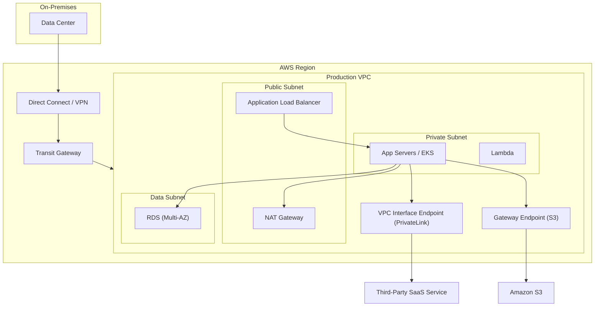

# DevOps & AWS Interview Prep

A curated set of interview questions with concise, interview-ready answers covering AWS services, DevOps tooling, containers, IaC, and policy-as-code.

## Table of Contents

1. [Logging](#1-logging)
2. [Containerization](#2-containerization)
3. [AWS Organizations](#3-aws-organizations)
4. [Cyber Attacks on AWS & Prevention](#4-cyber-attacks-on-aws--prevention)
5. [Hybrid Networking](#5-hybrid-networking)
6. [Warm Pool of Instances](#6-warm-pool-of-instances)
7. [AWS Lambda](#7-aws-lambda)
8. [Git — Advanced](#8-git--advanced)
9. [DR & Backup Strategies](#9-dr--backup-strategies)
10. [Networking & Private Access to Third-Party Services](#10-networking--private-access-to-third-party-services)
11. [SSO Concepts](#11-sso-concepts)
12. [Terraform — High Level](#12-terraform--high-level)
13. [Docker Security Mechanisms](#13-docker-security-mechanisms)
14. [Kubernetes & Custom Network Policies](#14-kubernetes--custom-network-policies)
15. [OPA & Sentinel Policy-as-Code](#15-opa--sentinel-policy-as-code)

---

## 1. Logging

**Q1. How do you design a centralized logging strategy in AWS?**
- Use **CloudWatch Logs** for application/OS logs via the CloudWatch agent.
- Stream logs to **Amazon OpenSearch / Kinesis Data Firehose** for search and analytics.
- Store long-term/immutable logs in **S3** (with lifecycle policies and Object Lock for compliance).
- Aggregate account-wide activity with **CloudTrail** (management + data events) and **VPC Flow Logs** for network traffic.
- For multi-account setups, centralize into a dedicated **Log Archive account** (Control Tower pattern).

**Q2. Difference between CloudTrail, CloudWatch, and VPC Flow Logs?**
- **CloudTrail** → *who did what* (API/audit trail).
- **CloudWatch** → *metrics, alarms, and application/system logs* (operational monitoring).
- **VPC Flow Logs** → *network traffic metadata* (source/dest IP, ports, accept/reject).

**Q3. What are the pillars of good log management?**
Structured logging (JSON), correlation IDs for tracing, log levels, retention policies, encryption at rest, access control, and alerting on anomalies.

**Q4. How do you handle log volume/cost?**
Sampling, log-level filtering at source, metric filters instead of storing everything, lifecycle transition to S3/Glacier, and subscription filters to route only relevant logs.

**Q5. What is the difference between structured and unstructured logging?**
Structured logs use a consistent machine-parseable format (JSON) enabling querying/filtering; unstructured logs are free-form text that is harder to search and analyze at scale.

---

## 2. Containerization

**Q1. What is containerization and how does it differ from virtualization?**
Containers virtualize the **OS** (share the host kernel) and package app + dependencies; VMs virtualize **hardware** (each has its own guest OS). Containers are lighter, faster to start, and more portable.

**Q2. What is a container image vs. a container?**
An **image** is an immutable, layered template; a **container** is a running instance of an image with a writable layer on top.

**Q3. What container orchestration options exist on AWS?**
- **ECS** (AWS-native), **EKS** (managed Kubernetes), **Fargate** (serverless compute for both), and self-managed K8s on EC2.

**Q4. Benefits of containerization?**
Consistency across environments, faster deployments, resource efficiency, isolation, easy scaling, and microservices enablement.

**Q5. What is a multi-stage Docker build and why use it?**
It uses multiple `FROM` stages to compile/build in one stage and copy only artifacts into a slim final image — reducing image size and attack surface.

---

## 3. AWS Organizations

**Q1. What is AWS Organizations?**
A service to centrally govern multiple AWS accounts — consolidated billing, account provisioning, and centralized policy enforcement.

**Q2. What are Service Control Policies (SCPs)?**
Guardrails that define the **maximum available permissions** for accounts/OUs. SCPs do not grant permissions — they set boundaries. They apply to IAM users/roles but **not** the management account root by default.

**Q3. What are Organizational Units (OUs)?**
Logical groupings of accounts (e.g., Prod, Dev, Security, Sandbox) to apply policies hierarchically.

**Q4. What is AWS Control Tower?**
An orchestration layer on top of Organizations that sets up a secure, multi-account **landing zone** with guardrails, a Log Archive account, and an Audit account.

**Q5. How does consolidated billing help?**
Single payer account, combined usage for volume discounts, and shared Reserved Instance/Savings Plan benefits across accounts.

**Q6. SCP vs. IAM policy — key difference?**
SCP defines the permission *boundary* for the whole account; IAM policy *grants* permissions within that boundary. Effective permission = intersection of both.

---

## 4. Cyber Attacks on AWS & Prevention

**Q1. What are common attack vectors on AWS?**
- Leaked IAM/access keys, misconfigured S3 buckets, exposed security groups, credential stuffing, DDoS, SSRF (metadata theft), privilege escalation, and supply-chain attacks.

**Q2. How do you prevent leaked credentials?**
Use IAM roles instead of long-lived keys, enforce MFA, rotate secrets (Secrets Manager), scan repos (git-secrets), and detect exposure via GuardDuty / Access Analyzer.

**Q3. How do you protect against DDoS?**
**AWS Shield** (Standard/Advanced), **AWS WAF** for L7 filtering, CloudFront/edge caching, Auto Scaling to absorb load, and rate limiting.

**Q4. How to prevent SSRF and metadata theft?**
Enforce **IMDSv2** (token-based instance metadata), restrict egress, and validate/allowlist outbound requests.

**Q5. Which AWS security services help detect/respond to attacks?**
- **GuardDuty** — threat detection.
- **Security Hub** — aggregated posture/compliance.
- **Inspector** — vulnerability scanning.
- **Macie** — sensitive data (PII) detection in S3.
- **Detective** — investigation/root cause.
- **WAF + Shield** — perimeter protection.
- **Config** — configuration compliance drift.

**Q6. Defense-in-depth on AWS — layers?**
Edge (Shield/WAF/CloudFront) → Network (VPC, SGs, NACLs, private subnets) → Identity (IAM least privilege, MFA) → Compute (patching, IMDSv2) → Data (encryption KMS, S3 policies) → Monitoring (GuardDuty, CloudTrail, Config).

**Q7. How do you secure S3 buckets?**
Block Public Access, bucket policies, encryption (SSE-KMS), versioning + Object Lock, VPC endpoints, and Access Analyzer to detect public/cross-account exposure.

---

## 5. Hybrid Networking

**Q1. What connectivity options link on-prem to AWS?**
- **VPN (Site-to-Site)** — encrypted over the internet, quick to set up.
- **Direct Connect (DX)** — dedicated private line, low latency, consistent bandwidth.
- **DX + VPN** — private link with encryption for compliance.

**Q2. VPN vs. Direct Connect — when to choose which?**
VPN for lower cost/quick setup with variable performance; Direct Connect for high, consistent throughput, low latency, and predictable performance (with VPN as backup for HA).

**Q3. What is a Transit Gateway?**
A cloud router that connects multiple VPCs and on-prem networks through a central hub, replacing complex VPC peering meshes and simplifying routing at scale.

**Q4. What is a Direct Connect Gateway?**
Lets you connect a DX connection to multiple VPCs across regions/accounts through a single gateway.

**Q5. How do you achieve HA for hybrid connectivity?**
Redundant DX connections in different locations, DX + VPN failover, BGP for dynamic routing, and multiple customer gateways.

**Q6. What is a Virtual Private Gateway vs. Transit Gateway?**
VGW attaches to a single VPC for VPN/DX; Transit Gateway scales to hundreds of VPCs and on-prem connections centrally.

---

## 6. Warm Pool of Instances

**Q1. What is a warm pool in EC2 Auto Scaling?**
A pool of pre-initialized (stopped or running) EC2 instances kept ready to serve traffic quickly during scale-out, reducing cold-start latency for apps with long boot/initialization times.

**Q2. What states can warm pool instances be in?**
- **Stopped** (cheapest — no compute charges, only EBS).
- **Running** (fastest, but incurs full cost).
- **Hibernated** (preserves in-memory state).

**Q3. When should you use a warm pool?**
When application initialization is slow (large data loads, JIT warm-up, cache priming) and you need rapid scale-out to meet sudden demand.

**Q4. How does it work with lifecycle hooks?**
Lifecycle hooks let you run initialization actions while instances are in the warm pool so they are fully ready before entering the InService state of the main ASG.

**Q5. Cost consideration for warm pools?**
Stopped instances only incur EBS storage cost — a good balance between readiness and cost vs. keeping running instances idle.

---

## 7. AWS Lambda

**Q1. What is AWS Lambda?**
A serverless compute service that runs code in response to events without provisioning/managing servers; you pay per invocation and compute duration.

**Q2. What is a cold start and how do you reduce it?**
Latency when a new execution environment is initialized. Reduce with **Provisioned Concurrency**, smaller packages, lighter runtimes, keeping dependencies minimal, and avoiding VPC where unnecessary (or using VPC networking improvements/Hyperplane ENIs).

**Q3. Lambda limits to know?**
Max timeout 15 min, memory 128 MB–10 GB (CPU scales with memory), /tmp up to 10 GB, deployment package 50 MB zipped (250 MB unzipped) or container image up to 10 GB, and concurrency limits per account/region.

**Q4. How do you handle Lambda concurrency?**
- **Reserved concurrency** caps and guarantees capacity for a function.
- **Provisioned concurrency** pre-warms environments for predictable low latency.

**Q5. Common Lambda invocation models?**
- **Synchronous** (API Gateway, ALB).
- **Asynchronous** (S3, SNS — with retries and DLQ).
- **Stream/poll-based** (SQS, Kinesis, DynamoDB Streams).

**Q6. How do you secure Lambda?**
Least-privilege execution role, environment variable encryption (KMS), secrets via Secrets Manager, VPC for private resources, and code signing.

**Q7. How do you handle errors and retries?**
Async invocations retry twice then send to a **Dead Letter Queue** or **on-failure destination**; use idempotency to handle duplicate deliveries.

---

## 8. Git — Advanced

**Q1. `git merge` vs. `git rebase`?**
Merge preserves history and creates a merge commit (non-linear); rebase rewrites commits onto a new base for a linear history. Never rebase shared/public branches.

**Q2. What is `git cherry-pick`?**
Applies a specific commit from one branch onto another without merging the whole branch.

**Q3. `git reset` vs. `git revert`?**
`reset` moves the branch pointer (rewrites history — `--soft`/`--mixed`/`--hard`); `revert` creates a new commit that undoes a previous one (safe for shared branches).

**Q4. What is an interactive rebase used for?**
`git rebase -i` to squash, reorder, edit, or drop commits to clean up history before merging.

**Q5. What is `git bisect`?**
A binary search across commits to find the commit that introduced a bug.

**Q6. What is `git reflog`?**
A log of where HEAD and branch refs have pointed — used to recover "lost" commits after a bad reset/rebase.

**Q7. What is a fast-forward merge?**
When the target branch has no new commits, Git simply moves the pointer forward without creating a merge commit.

**Q8. What are Git hooks?**
Scripts triggered by events (pre-commit, pre-push, commit-msg) to enforce linting, tests, or commit conventions.

**Q9. Branching strategies?**
GitFlow (feature/develop/release/hotfix), GitHub Flow (main + short-lived feature branches), and trunk-based development (frequent small merges to main with feature flags).

**Q10. What is `git stash` used for?**
Temporarily shelves uncommitted changes so you can switch context, then reapply them later.

---

## 9. DR & Backup Strategies

**Q1. What are the four AWS DR strategies (increasing RTO/RPO cost)?**
1. **Backup & Restore** — cheapest, highest RTO/RPO.
2. **Pilot Light** — core minimal infra always on, scale up on failover.
3. **Warm Standby** — scaled-down full stack always running.
4. **Multi-Site Active/Active** — full production in multiple regions, near-zero RTO/RPO, highest cost.

**Q2. Define RTO and RPO.**
- **RTO** (Recovery Time Objective) — max acceptable downtime.
- **RPO** (Recovery Point Objective) — max acceptable data loss (time since last good backup).

**Q3. Backup strategies on AWS?**
- **AWS Backup** — centralized, policy-based backups across services.
- **EBS/RDS snapshots**, cross-region/cross-account copy.
- **S3 versioning + lifecycle + replication (CRR)**.
- **Point-in-time recovery** for RDS/DynamoDB.

**Q4. What is the 3-2-1 backup rule?**
3 copies of data, on 2 different media types, with 1 copy off-site (e.g., another region/account).

**Q5. How do you protect backups from ransomware/deletion?**
Immutability via **S3 Object Lock / Backup Vault Lock (WORM)**, cross-account isolation, MFA delete, and least-privilege access.

**Q6. How do you test DR?**
Regular game-days/failover drills, automated recovery runbooks, and validating RTO/RPO targets are actually met.

**Q7. Database DR — how to replicate cross-region?**
RDS cross-region read replicas / Aurora Global Database, DynamoDB Global Tables, and automated snapshot copies.

---

## 10. Networking & Private Access to Third-Party Services

**Q1. How do you access third-party/SaaS services privately in AWS?**
- **AWS PrivateLink** with **VPC Interface Endpoints** — exposes a service via a private ENI with a private IP in your VPC; traffic never traverses the public internet.
- Providers publish an **Endpoint Service** (via NLB); consumers create interface endpoints to it.

**Q2. VPC Interface Endpoint vs. Gateway Endpoint?**
- **Interface Endpoint (PrivateLink)** — ENI with private IP; works for most AWS/partner/SaaS services.
- **Gateway Endpoint** — route-table entry; only for **S3 and DynamoDB** (free).

**Q3. What is AWS PrivateLink and its benefit?**
Private connectivity between VPCs, AWS services, and SaaS without exposing traffic to the internet, no route through IGW/NAT, and avoids IP overlap issues.

**Q4. How do you access AWS public services (like S3) privately?**
Use VPC endpoints (Gateway for S3/DynamoDB, Interface for others) so instances in private subnets reach services without a NAT gateway/internet.

**Q5. Public vs. private subnet?**
Public subnet has a route to an **Internet Gateway**; private subnet does not (uses NAT Gateway for outbound-only, or VPC endpoints).

**Q6. Security Groups vs. NACLs?**
- **SG** — stateful, instance-level, allow rules only.
- **NACL** — stateless, subnet-level, allow + deny rules.

### Reference Architecture Diagram



---

## 11. SSO Concepts

**Q1. What is SSO (Single Sign-On)?**
Lets users authenticate once with a single set of credentials to access multiple applications/accounts without re-logging in.

**Q2. What is AWS IAM Identity Center (formerly AWS SSO)?**
Centralized access management for multiple AWS accounts and business apps; integrates with external IdPs and assigns permission sets to users/groups per account.

**Q3. SAML vs. OIDC vs. OAuth 2.0?**
- **SAML 2.0** — XML-based, enterprise SSO for web apps.
- **OIDC** — identity layer on top of OAuth 2.0 (authentication).
- **OAuth 2.0** — authorization framework (delegated access, not authentication by itself).

**Q4. What is federation?**
Trusting an external Identity Provider (Okta, Azure AD, Google) to authenticate users, who then assume AWS roles via temporary credentials (STS).

**Q5. What is a permission set in IAM Identity Center?**
A collection of IAM policies that defines the level of access a user/group gets when they access an assigned AWS account.

**Q6. Benefits of SSO?**
Reduced password fatigue, centralized access control, easier onboarding/offboarding, MFA enforcement, and improved audit/compliance.

---

## 12. Terraform — High Level

**Q1. What is Terraform?**
An open-source Infrastructure-as-Code (IaC) tool by HashiCorp using declarative HCL to provision and manage infrastructure across cloud providers.

**Q2. Core Terraform workflow?**
`terraform init` → `plan` → `apply` → `destroy`. Init downloads providers/modules; plan shows changes; apply provisions; destroy tears down.

**Q3. What is Terraform state and why does it matter?**
The `terraform.tfstate` file maps config to real resources. Store it **remotely** (S3 + DynamoDB lock) for team collaboration, locking, and to avoid drift/conflicts.

**Q4. What are modules?**
Reusable, parameterized groups of resources that promote DRY, consistency, and standardization across environments.

**Q5. Terraform vs. CloudFormation?**
Terraform is multi-cloud, HCL-based, with a large provider ecosystem; CloudFormation is AWS-native (JSON/YAML) with tight AWS integration.

**Q6. What is `terraform plan` vs. `apply`?**
`plan` is a dry-run preview of changes; `apply` executes them. Always review the plan before applying.

**Q7. How do you handle secrets in Terraform?**
Never hardcode; use environment variables, Vault, AWS Secrets Manager/SSM, and mark variables `sensitive = true`; keep state encrypted (state can contain secrets).

**Q8. What are workspaces?**
Isolated state instances within a config, useful for managing multiple environments (dev/stage/prod) — though separate state files/backends per env are often preferred.

**Q9. What is drift and how do you detect it?**
When real infra differs from state/config; detect via `terraform plan` or `terraform refresh`/drift detection.

---

## 13. Docker Security Mechanisms

**Q1. What built-in Linux features does Docker use for isolation?**
- **Namespaces** — isolate PID, network, mount, UTS, IPC, user (process view isolation).
- **Cgroups** — limit CPU/memory/IO resource usage.
- **Capabilities** — drop root privileges to fine-grained capabilities.
- **Seccomp** — restrict allowed syscalls.
- **AppArmor / SELinux** — mandatory access control profiles.

**Q2. How do you reduce a container's attack surface?**
Use minimal base images (distroless/alpine), multi-stage builds, run as **non-root user**, drop unneeded capabilities, read-only root filesystem, and no privileged mode.

**Q3. What is Docker Content Trust (DCT)?**
Image signing/verification using Notary to ensure image integrity and authenticity of pulled images.

**Q4. How do you scan images for vulnerabilities?**
Tools like **Trivy, Clair, Snyk, Amazon ECR image scanning (Inspector)** to detect CVEs in image layers/dependencies.

**Q5. What are Docker secrets?**
A mechanism (in Swarm) to securely provide sensitive data to containers, stored encrypted and mounted in-memory rather than baked into images/env vars.

**Q6. Best practices for securing the Docker daemon?**
Don't expose the daemon socket over unencrypted TCP, use TLS mutual auth, restrict access to `/var/run/docker.sock`, and keep the daemon/host patched.

**Q7. Why avoid running containers as root?**
A container root can become host root if there's a kernel/escape vulnerability; use user namespaces and non-root users to limit blast radius.

---

## 14. Kubernetes & Custom Network Policies

**Q1. What is Kubernetes?**
An open-source container orchestration platform for automating deployment, scaling, and management of containerized applications.

**Q2. Key Kubernetes components?**
- **Control plane**: API server, etcd, scheduler, controller manager.
- **Nodes**: kubelet, kube-proxy, container runtime (containerd).
- **Objects**: Pods, Deployments, Services, ConfigMaps, Secrets, Ingress.

**Q3. What is a NetworkPolicy?**
A Kubernetes resource that controls **pod-to-pod / namespace traffic** at L3/L4 using label selectors. By default all pods can talk to each other; policies are additive and enforced by the CNI.

**Q4. Example: custom NetworkPolicy (deny all ingress, allow only from app).**
```yaml
apiVersion: networking.k8s.io/v1
kind: NetworkPolicy
metadata:
  name: db-allow-from-app
  namespace: production
spec:
  podSelector:
    matchLabels:
      role: database
  policyTypes:
    - Ingress
  ingress:
    - from:
        - podSelector:
            matchLabels:
              role: app
      ports:
        - protocol: TCP
          port: 5432
```
This allows only pods labeled `role: app` to reach `role: database` pods on port 5432; all other ingress is denied.

**Q5. Which CNIs enforce NetworkPolicies?**
**Calico, Cilium, Weave Net** (the default `kubenet`/flannel may not enforce policies). Cilium adds L7 policies via eBPF.

**Q6. How do you write a default-deny policy?**
Apply a policy with an empty `podSelector` and `policyTypes: Ingress` (and/or Egress) with no `ingress`/`egress` rules — this blocks all traffic, then layer allow rules.

### More NetworkPolicy Examples

**Example 1: Default-deny all ingress in a namespace.**
```yaml
apiVersion: networking.k8s.io/v1
kind: NetworkPolicy
metadata:
  name: default-deny-ingress
  namespace: production
spec:
  podSelector: {}
  policyTypes:
    - Ingress
```
An empty `podSelector` selects all pods; with no `ingress` rules, all incoming traffic is denied.

**Example 2: Default-deny all egress.**
```yaml
apiVersion: networking.k8s.io/v1
kind: NetworkPolicy
metadata:
  name: default-deny-egress
  namespace: production
spec:
  podSelector: {}
  policyTypes:
    - Egress
```
Blocks all outbound traffic from every pod in the namespace until explicit egress rules are added.

**Example 3: Default-deny all ingress and egress (full lockdown).**
```yaml
apiVersion: networking.k8s.io/v1
kind: NetworkPolicy
metadata:
  name: default-deny-all
  namespace: production
spec:
  podSelector: {}
  policyTypes:
    - Ingress
    - Egress
```

**Example 4: Allow ingress only from a specific namespace.**
```yaml
apiVersion: networking.k8s.io/v1
kind: NetworkPolicy
metadata:
  name: allow-from-monitoring-ns
  namespace: production
spec:
  podSelector:
    matchLabels:
      role: api
  policyTypes:
    - Ingress
  ingress:
    - from:
        - namespaceSelector:
            matchLabels:
              team: monitoring
      ports:
        - protocol: TCP
          port: 8080
```
Only pods in namespaces labeled `team: monitoring` can reach `role: api` pods on port 8080.

**Example 5: Allow egress to DNS only (CoreDNS).**
```yaml
apiVersion: networking.k8s.io/v1
kind: NetworkPolicy
metadata:
  name: allow-dns-egress
  namespace: production
spec:
  podSelector: {}
  policyTypes:
    - Egress
  egress:
    - to:
        - namespaceSelector:
            matchLabels:
              kubernetes.io/metadata.name: kube-system
      ports:
        - protocol: UDP
          port: 53
        - protocol: TCP
          port: 53
```
A common companion to a default-deny-egress policy so pods can still resolve DNS.

**Example 6: Allow egress to an external CIDR (with exceptions).**
```yaml
apiVersion: networking.k8s.io/v1
kind: NetworkPolicy
metadata:
  name: allow-external-egress
  namespace: production
spec:
  podSelector:
    matchLabels:
      role: worker
  policyTypes:
    - Egress
  egress:
    - to:
        - ipBlock:
            cidr: 0.0.0.0/0
            except:
              - 169.254.169.254/32   # block cloud metadata endpoint
              - 10.0.0.0/8            # block internal RFC1918 range
      ports:
        - protocol: TCP
          port: 443
```
Uses `ipBlock` to allow outbound HTTPS to the internet while blocking the instance metadata service and internal ranges.

**Example 7: Combine podSelector and namespaceSelector (AND logic).**
```yaml
apiVersion: networking.k8s.io/v1
kind: NetworkPolicy
metadata:
  name: allow-app-from-trusted-ns
  namespace: production
spec:
  podSelector:
    matchLabels:
      role: database
  policyTypes:
    - Ingress
  ingress:
    - from:
        - namespaceSelector:
            matchLabels:
              env: prod
          podSelector:
            matchLabels:
              role: app
      ports:
        - protocol: TCP
          port: 5432
```
A single `from` entry with both selectors means traffic must come from `role: app` pods **that also live in** an `env: prod` namespace. (Listing them as separate `-` items would be OR logic instead.)

**Example 8: Allow ingress from anywhere on a public port.**
```yaml
apiVersion: networking.k8s.io/v1
kind: NetworkPolicy
metadata:
  name: allow-public-web
  namespace: production
spec:
  podSelector:
    matchLabels:
      role: frontend
  policyTypes:
    - Ingress
  ingress:
    - from: []
      ports:
        - protocol: TCP
          port: 80
        - protocol: TCP
          port: 443
```
An empty `from: []` allows traffic from all sources to the frontend on ports 80/443.

**Q7. What tools do you use to work with/secure Kubernetes?**
- **Deployment/packaging**: Helm, Kustomize.
- **CI/CD & GitOps**: ArgoCD, Flux.
- **Networking/policy**: Calico, Cilium.
- **Security scanning**: Trivy, kube-bench, kube-hunter, Falco (runtime).
- **Policy-as-code**: OPA Gatekeeper, Kyverno.
- **Observability**: Prometheus, Grafana, Loki, Jaeger.
- **Service mesh**: Istio, Linkerd.

**Q8. Ingress vs. Egress in a NetworkPolicy?**
Ingress controls incoming traffic to selected pods; Egress controls outgoing traffic from selected pods.

**Q9. RBAC vs. NetworkPolicy?**
RBAC controls **who can perform API actions** (authorization); NetworkPolicy controls **network traffic between pods**.

---

## 15. OPA & Sentinel Policy-as-Code

**Q1. What is OPA (Open Policy Agent)?**
A general-purpose, open-source policy engine that decouples policy decisions from application logic. Policies are written in the **Rego** language and OPA returns allow/deny decisions.

**Q2. Where is OPA used?**
Kubernetes admission control (via **Gatekeeper**), microservice authorization, API gateways, Terraform plan validation, and CI/CD gating.

**Q3. What is OPA Gatekeeper?**
A Kubernetes admission controller that enforces OPA policies as CRDs (ConstraintTemplates + Constraints) to validate/reject non-compliant resources (e.g., "no privileged pods", "images from approved registries only").

**Q4. What is the Rego language?**
A declarative query language used by OPA to express policies as rules that evaluate input JSON/YAML data and produce decisions.

**Q5. What is HashiCorp Sentinel?**
A **policy-as-code framework embedded in HashiCorp Enterprise products** (Terraform Cloud/Enterprise, Vault, Consul, Nomad) to enforce fine-grained, logic-based guardrails.

**Q6. Sentinel enforcement levels?**
- **Advisory** — warn only.
- **Soft-mandatory** — fail but can be overridden by authorized users.
- **Hard-mandatory** — must pass; cannot be overridden.

**Q7. OPA vs. Sentinel — key differences?**
| Aspect | OPA | Sentinel |
|--------|-----|----------|
| License | Open source (CNCF) | Proprietary (HashiCorp Enterprise) |
| Language | Rego | Sentinel language |
| Ecosystem | Cloud-native / K8s / general | HashiCorp stack (Terraform, Vault) |
| Use case | Broad, vendor-neutral | Guardrails within Terraform/Vault workflows |

**Q8. Example use case for policy-as-code in Terraform?**
Deny provisioning of public S3 buckets, enforce mandatory tags, restrict instance types/regions, or require encryption — evaluated on the Terraform plan before apply.

**Q9. Why use policy-as-code?**
Consistent, automated, version-controlled governance; shift-left compliance; auditability; and prevention of misconfigurations before they reach production.
